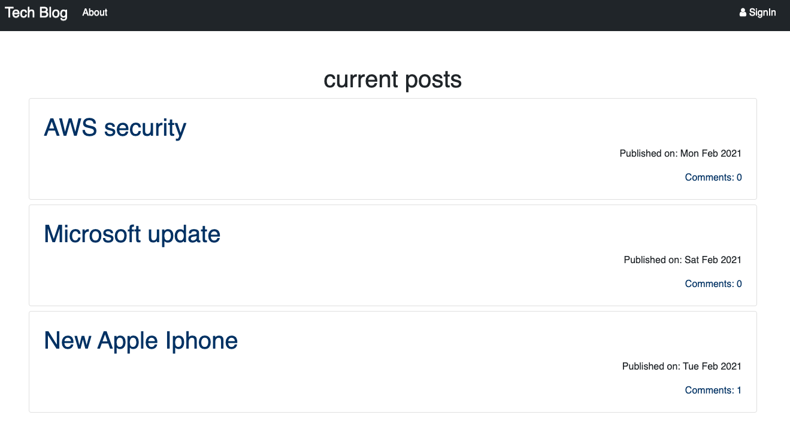
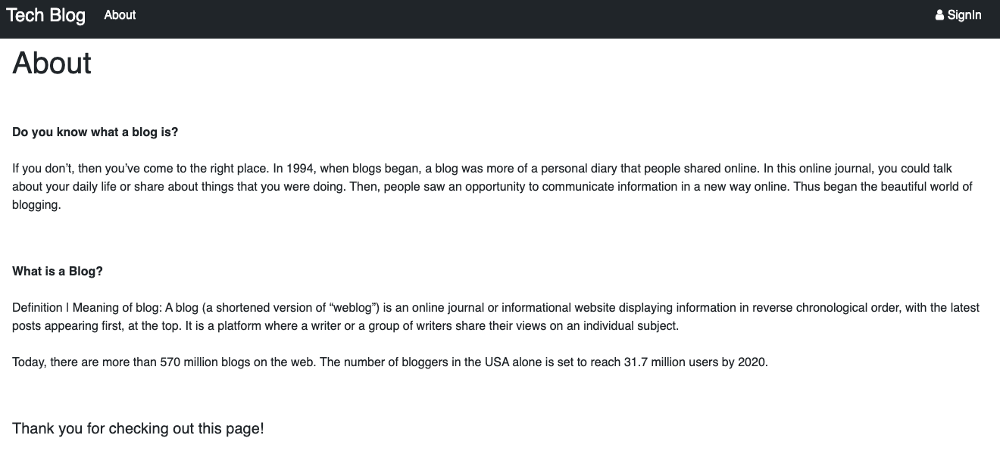
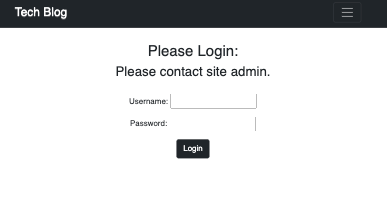
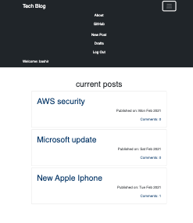
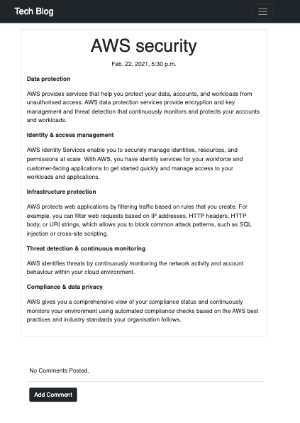
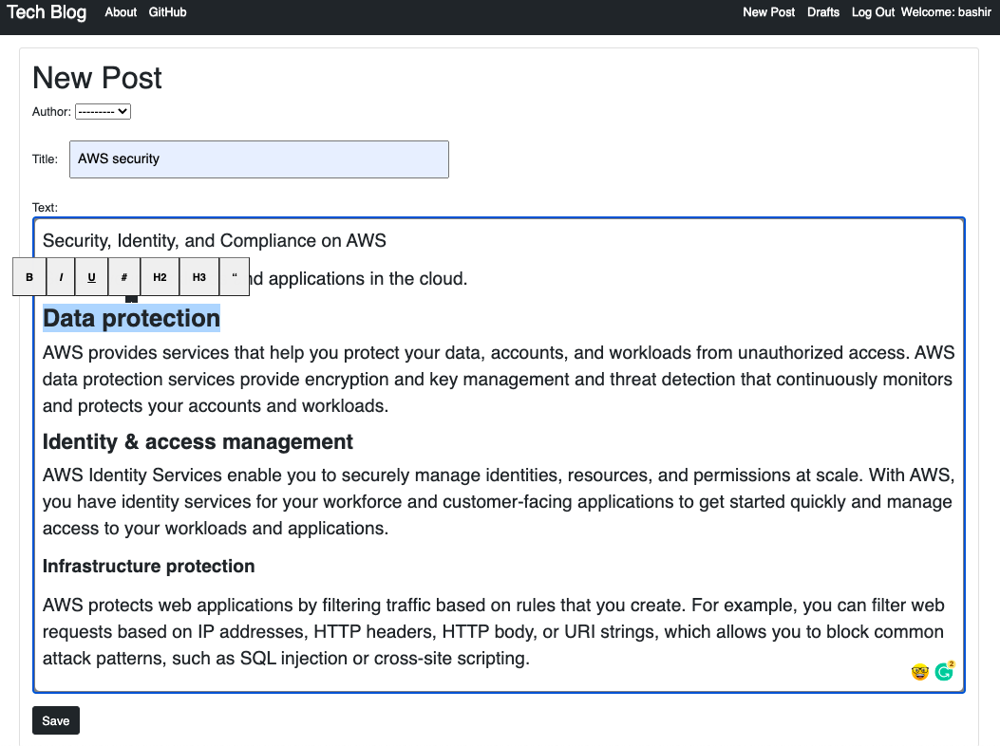
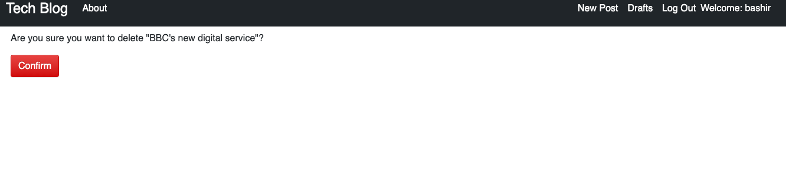
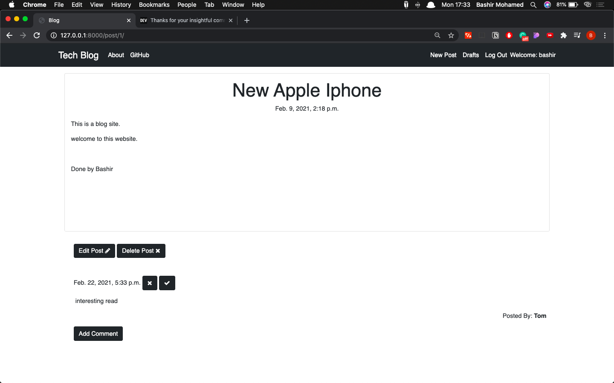
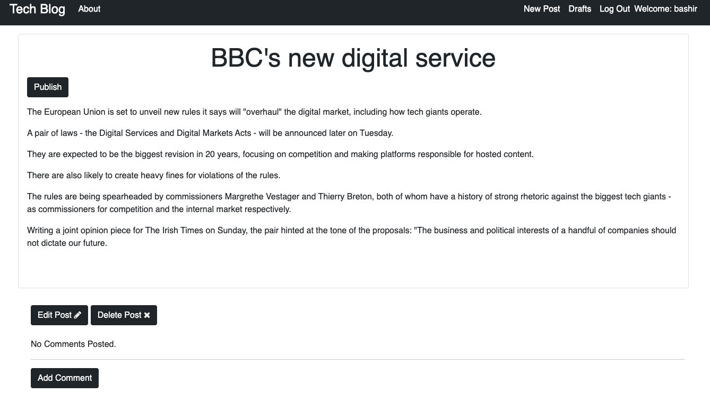

 

  <h3 align="center">Tech Blog</h3>
  

    blog that can be used both for personal and 
    moreover  as a company blog as you can have multiple users.
  

 
</h2> 

 [**here**](https://drive.google.com/file/d/1iR-zAYz3vrjU6UV1_VyRQ_L72HHvmSbd/view?usp=sharing) </ins> 

 
 

## Table of Contents

* [About the Project](#about-the-project)
* [Built With](#built-with)
* [Getting Started](#getting-started)
* [Installation](#installation)
* [Features](#Features)
* [Screenshots](#Screenshots)
* [Future Development](#Future-Development)

 
 

## About The Project

This project is a blog that can be used both for personal and moreover as a company blog as you can have multiple users. 

This blog is a multi-user blog and has the potential as it can be easily extended. 

 
 

### Built With

* [Django 3.1.5](https://docs.djangoproject.com/en/3.1/releases/3.1.5/)
* [Python 3.8.5](https://www.python.org/downloads/release/python-385/)
* [Bootstrap 5](https://getbootstrap.com/docs/5.0/getting-started/introduction/)
* [Medium Editor](https://github.com/yabwe/medium-editor)
* [Font Awesome](https://fontawesome.com/)
* [Google Fonts](https://fonts.google.com/)
* Custom CSS

 
 

## Getting Started

To get this blog up and running follow these simple steps.

1. Go to the project root folder 
2. Create virtual environment:
`python -m venv /path/to/new/virtual/environment`
3. Activate virtual environment 
4. start local server
`python manage.py runserver`
5. Got to the url shown on your terminal:
`http://127.0.0.1:8000/`

 
 

### Features

* Login/Logout 
* List of all posts in date order
* Publish new post with Medium Editor
* Remove posts by published
* Add and remove comments 
* Save drafts 
* Responsive to all devices  

 
 

## Screenshots

 
 

## Future Development
There are many improvements that can be made to the application. However, to name a few:
* this blog can be integrated to a pre-existing company site and used in subdomain and licence for company use
* Add functionally of multiple users and authors.
* Add API calls from reliable writing cms such as ghost and notion 
* Add more testing to make it even more robust, including integration testing
 
 

## Author

Done by Bashir
